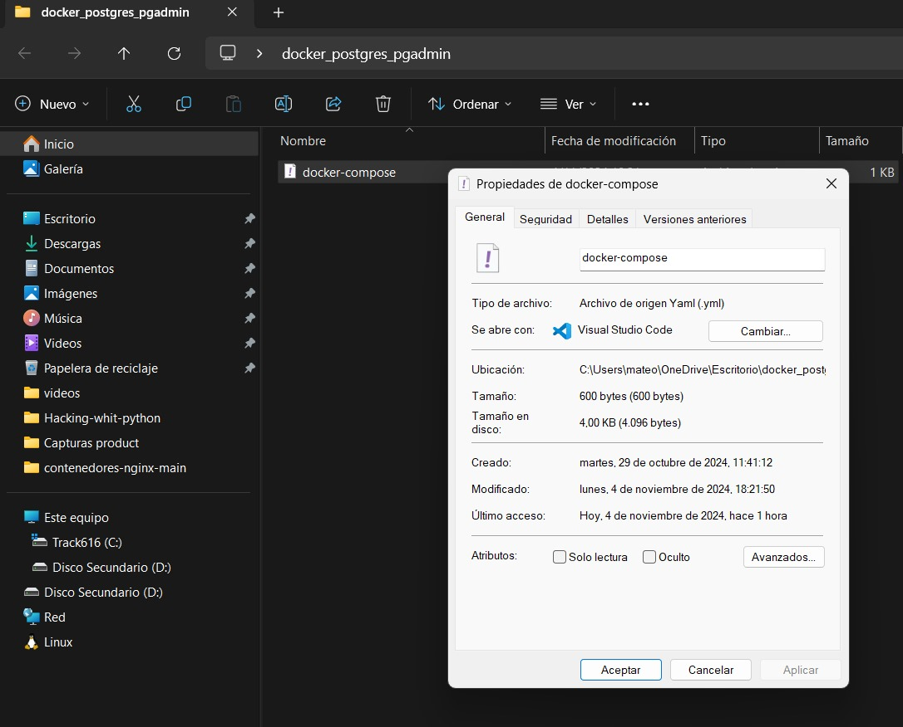
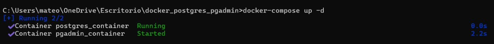
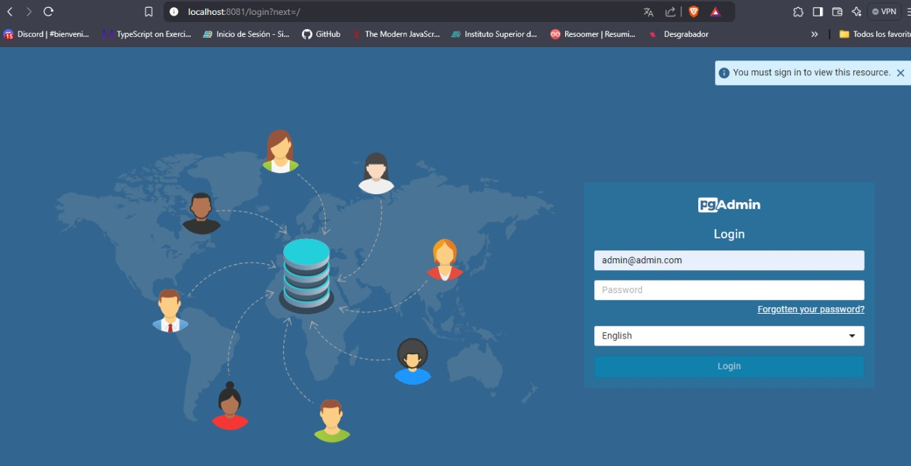
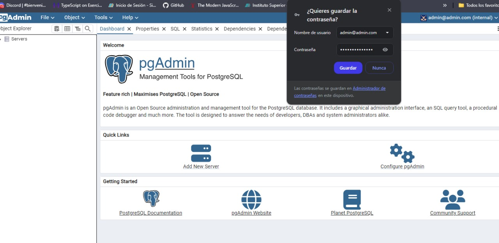
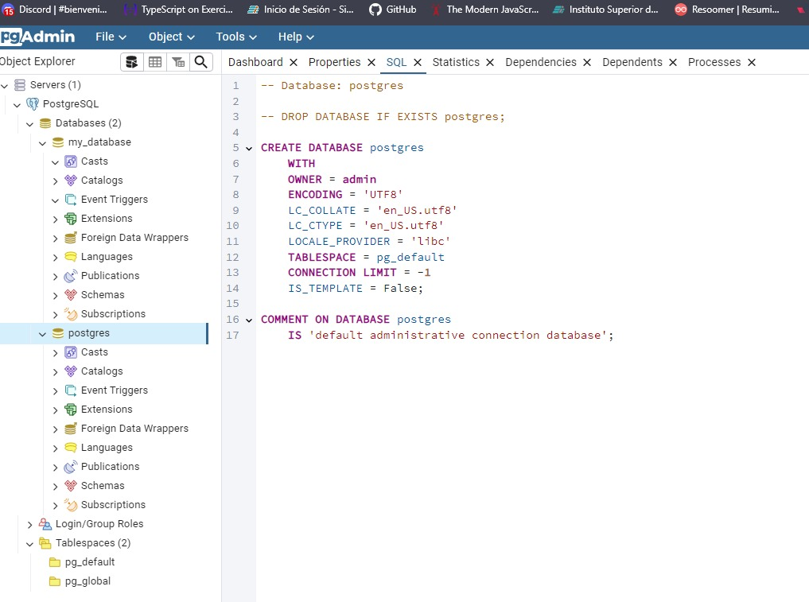

# Informe de Práctica: Configuración de PostgreSQL y pgAdmin con Docker Compose MATEO GALAN

## 1. Objetivo
El objetivo de esta práctica es configurar y ejecutar contenedores de PostgreSQL y pgAdmin usando Docker Compose. Este enfoque permite gestionar
 ambos servicios desde un único archivo YAML (`docker-compose.yml`), facilitando la implementación y administración.

## 2. Requisitos previos
- **Docker** y **Docker Compose** deben estar instalados en el sistema.
- Conocimientos básicos sobre contenedores y Docker.

## 3. Creación del archivo `docker-compose.yml`
Se creó un archivo YML (`docker-compose.yml`) para definir los servicios de PostgreSQL y pgAdmin. La configuración es la siguiente:

### Contenido del archivo `docker-compose.yml`

# yml
services:
  postgres:
    image: postgres:latest
    container_name: postgres_container
    environment:
      POSTGRES_USER: admin
      POSTGRES_PASSWORD: admin_password
      POSTGRES_DB: my_database
    ports:
      - "5432:5432"
    volumes:
      - postgres_data:/var/lib/postgresql/data

  # pgadmin:
    image: dpage/pgadmin4
    container_name: pgadmin_container
    environment:
      PGADMIN_DEFAULT_EMAIL: admin@admin.com
      PGADMIN_DEFAULT_PASSWORD: admin_password
    ports:
      - "8080:80"
    depends_on:
      - postgres

volumes:
  postgres_data:

## Explicación de la configuración:

El servicio postgres usa la imagen oficial de PostgreSQL y configura las variables de entorno para definir el usuario, contraseña y base de datos.
El servicio pgadmin usa la imagen de pgAdmin, exponiendo su interfaz en el puerto 8080 y configurando credenciales para el acceso.
El volumen postgres_data permite que los datos de PostgreSQL persistan, evitando la pérdida de datos al reiniciar el contenedor.

## Ejecución de Docker Compose
Para ejecutar los servicios definidos en docker-compose.yml, se utilizó el siguiente comando:

docker-compose up -d

Este comando levanta ambos servicios en segundo plano (-d).

## Verificación de la conexión y funcionamiento
 Verificación de contenedores
Se utilizó el comando docker-compose ps para verificar que ambos contenedores estuvieran en estado "Up". También se accedió a pgAdmin en el navegador 
(http://localhost:8080) para confirmar que estaba funcionando correctamente.

 Conexión de PostgreSQL a pgAdmin
Desde pgAdmin, se creó un nuevo servidor:
Hostname: postgres (nombre del servicio en Docker Compose)
Username: admin
Password: admin_password
Se verificó que la base de datos my_database era visible y accesible.

## Solución de problemas comunes
Advertencia sobre la versión obsoleta
Docker Compose mostró una advertencia indicando que el atributo version es obsoleto. La solución fue eliminar la línea version del archivo YAML.

Error de conexión con Docker Desktop
Hubo un error al conectar con el servicio Docker Desktop Linux Engine. Los pasos de solución fueron:

Confirmar que Docker Desktop estaba ejecutándose y en modo Linux.
Reiniciar Docker Desktop para resolver la conexión.

Ejecutar nuevamente docker-compose up -d.

## Conclusión
La práctica permitió configurar y verificar la correcta ejecución de PostgreSQL y pgAdmin mediante Docker Compose, 
además de resolver problemas comunes como advertencias de configuración y errores de conexión con Docker Desktop.
